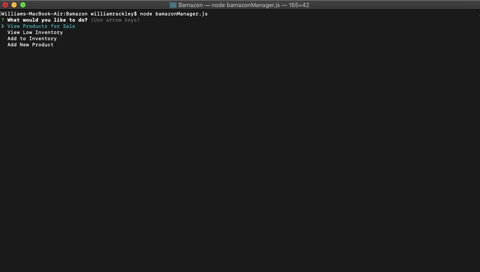
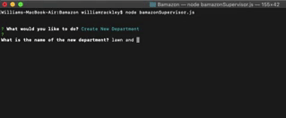

# Bamazon
This application is an amazon-like storefront that uses mySQL and Node.js. The app takes in orders from customers and depletes stock from the store's inventory. The 'manager' of the store can also view and add inventory and add new products. The 'supervisor' of the store has the ability to view the total profit of each department and also create new departments.

## The Customer
* As a customer, you are presented a table of the products that are available for sale. You are able to choose a product by specifying the item id and the amount of units you would like to purchase. 

* If the store has enough inventory, you will be presented with the amount of money that you owe and the table is updated with the available inventory and product sales. 

* If the store does not have enough inventory to fullfill your order, then it will tell you that there is insufficent inventory and the products table will re-display and allow you to change your order.

## The Manager
* As a manager, when you log into the store you are presented with 4 menu options: View Products for Sale, View Low Inventory, Add to Inventory, and Add New Product.

* Viewing the products for sale and the products that have low inventory

* Adding to Inventory. Once inventory has been added, the application tells the manager that the inventory has been added and tells them how many units are availabe for purchase.

* Adding a new product. The manager is prompted to input the name, department, price and stock quantity of the new product and after that the info is added to the stores database.

## The Supervisor

* Viewing The total profits of each department. This table shows the total sales of each item and subtracts the over head costs, which shows the supervisor the profits. (the table only displays departments that have made sales)

* Creating a Department. 

* The database table before adding the department

* The database table after adding the department

